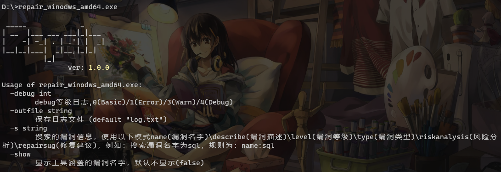
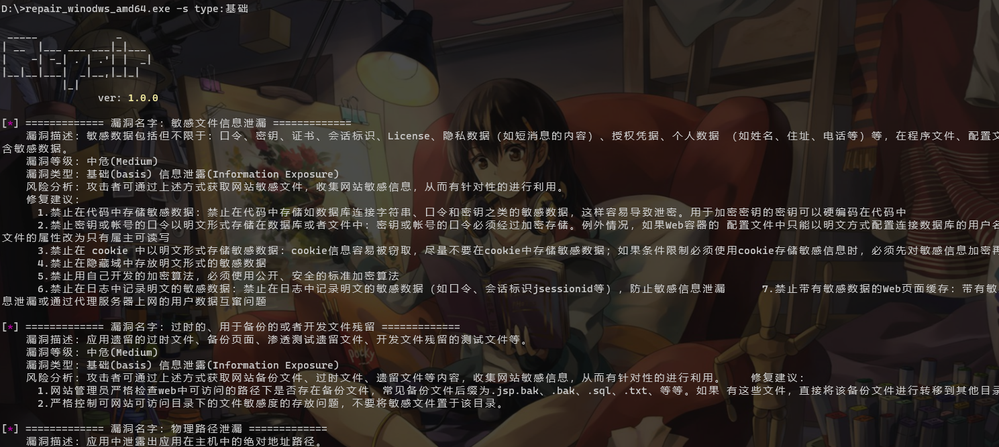

# Repair

# 壹 简介

一个关于漏洞介绍和修复建议的查询工具

平时在做渗透测试或者代码审计的时候，常常会因为需要写修复建议，网上搜索的时候七杂八杂，这时候这个工具就应运而生了。收集了一些主流漏洞的修复建议，通过关键字去搜索漏洞相关的信息，旨在提高工作效率和减少无用工作，节约时间多摸点鱼。

==可能有些修复建议不标准或者不全面，师傅们可以提个`issues`，方便修改，将工具的修复建议规范化和标准化。==

# 贰 使用

- 编译

```bash
# windows
go env -w GOOS=windows
go build -o repair_winodws_amd64.exe -ldflags="-s -w" -trimpath  .
# linux
go env -w GOOS=linux
go build -o repair_linux_amd64 -ldflags="-s -w" -trimpath  .
# macOS
go env -w GOOS=darwin
go build -o repair_darwin_amd64 -ldflags="-s -w" -trimpath  .
```

- 帮助`-h`



- 通过漏洞名字搜索


- 通过漏洞类型搜索



- 搜索全部关键字


- 显示工具涵盖的漏洞名字


# 伍 更新

- v1.0.0：最初的版本
